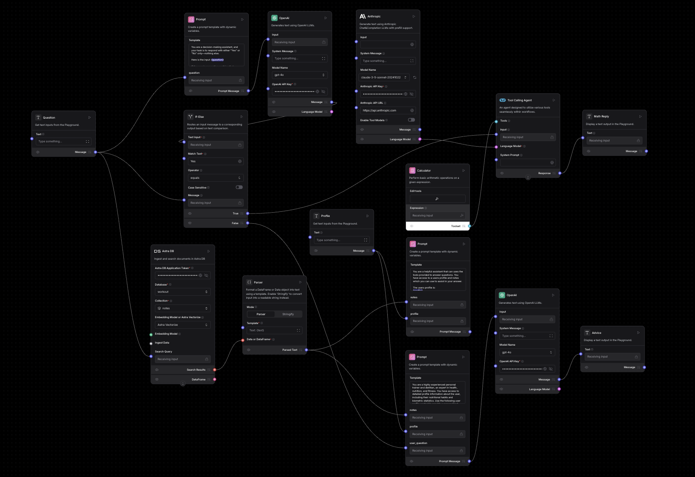
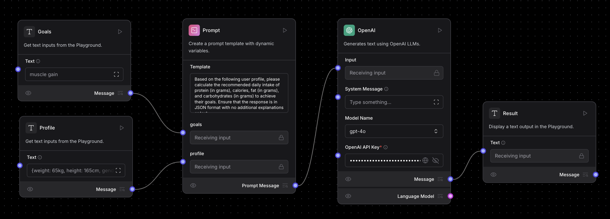
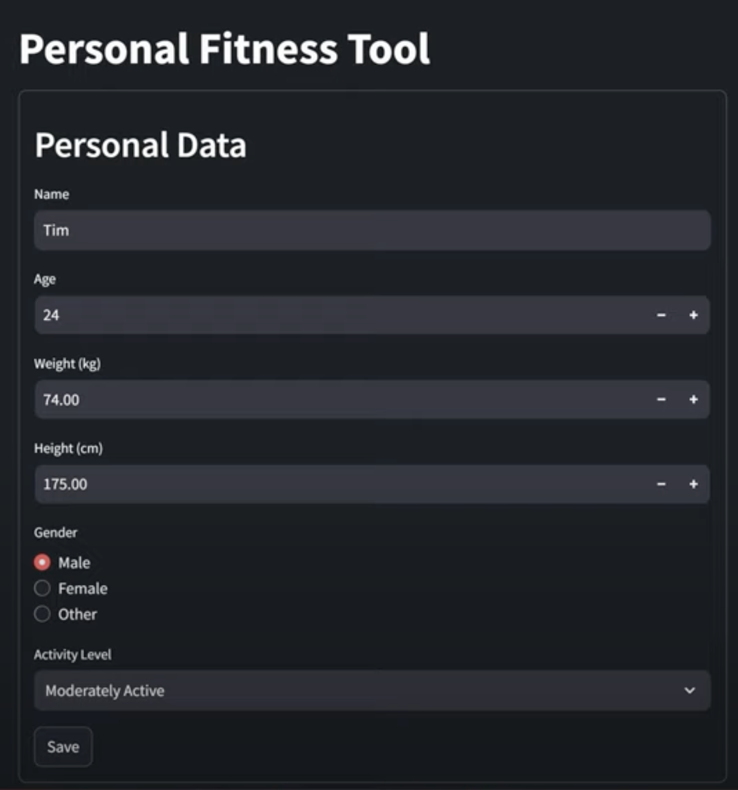
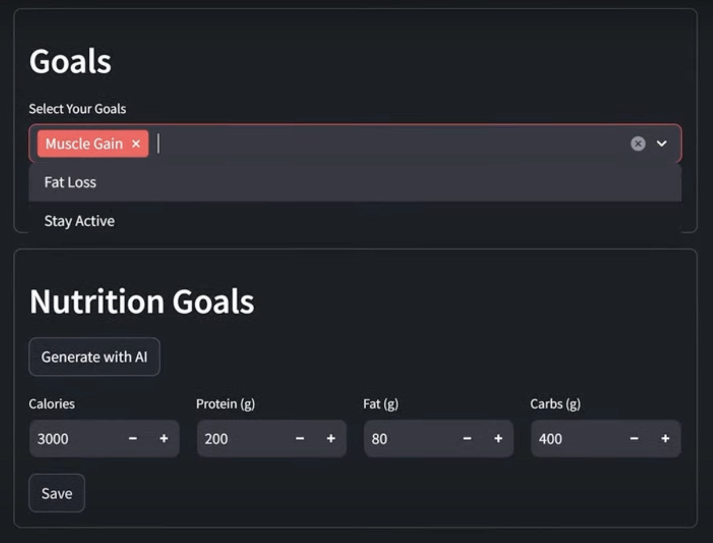
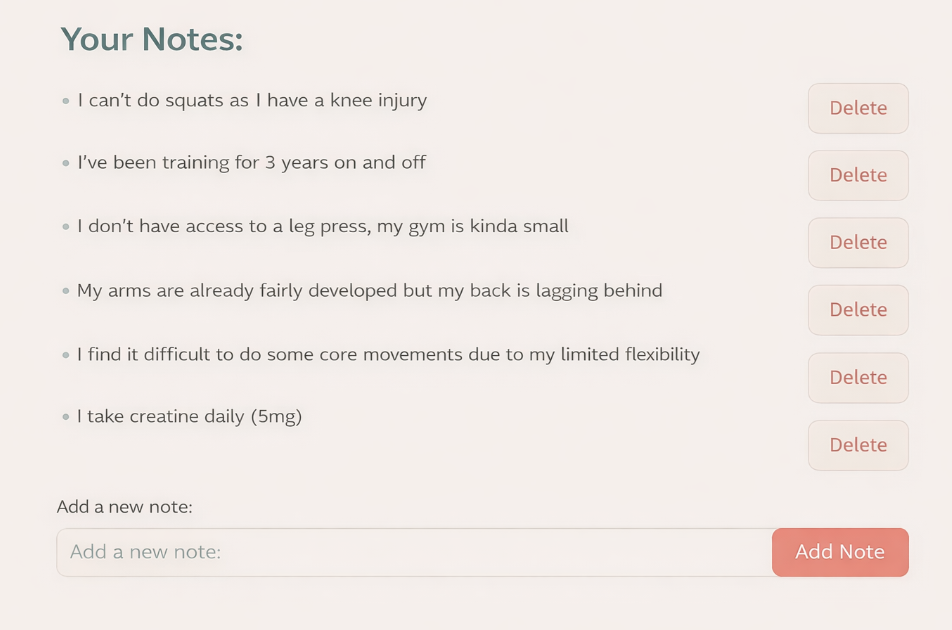
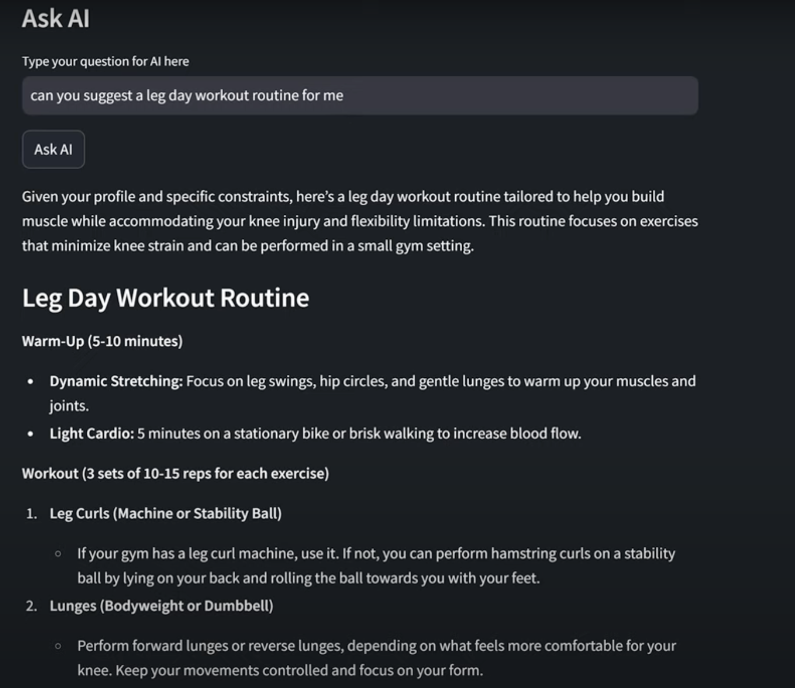

# 🧠 MultiAgent-WorkoutApp

This is a full-stack AI-powered fitness assistant that uses **multi-agent LLM orchestration**, **dynamic prompt routing**, **cloud-native storage**, and **retrieval-augmented generation (RAG)** to deliver personalized health and wellness recommendations. Built entirely from scratch, this app demonstrates advanced capabilities in intelligent agent design, Langflow-based orchestration, and production-grade AI integration.

---

## 🏋️ What is MultiAgent-WorkoutApp?

This is an intelligent assistant designed to support users in their fitness journey by:

- Collecting and storing user-specific data
- Dynamically selecting the right LLM (OpenAI/Claude) for various tasks
- Generating personalized nutrition, workout, and goal-based recommendations
- Maintaining memory and context through database integration
- Enhancing response accuracy through vectorized RAG from AstraDB


## ⚙️ Core Features

| Feature                                 | Description                                                                   |
| --------------------------------------- | ----------------------------------------------------------------------------- |
| Multi-Agent Routing                  | Different LLMs handle specific tasks (Claude for planning, GPT for nutrition) |
| Langflow-Based Flows                 | Visual agent flows with conditional logic, prompt templates, and tools        |
| Personalized AI Feedback             | Recommendations tailored to goals (e.g., muscle gain, fat loss)               |
| AstraDB Integration                  | User data and vectorized documents are persisted for contextual recall        |
| Retrieval-Augmented Generation (RAG) | Vector search from AstraDB enhances accuracy of LLM responses                 |
| Dynamic Prompt Injection             | Templates adapt to each user profile and goal automatically                   |
| Full UI via Streamlit               | Interactive frontend with forms and Ask AI panel                              |

---

## 🧠 System Architecture

```
                        ┌──────────────────────────┐
                        │     Streamlit Frontend   │◄─── User Interface (Forms, AI Chat)
                        └────────────┬─────────────┘
                                     │
                    ┌────────────────▼───────────────┐
                    │         Python Backend         │
                    │  - Langflow API Adapter        │
                    │  - Task Router + Prompt Engine │
                    │  - DB Connectors               │
                    └────────────────┬───────────────┘
                                     │
     ┌───────────────────────────────┼──────────────────────────────┐
     │                               │                              │
┌────▼─────┐                ┌────────▼────────┐              ┌──────▼──────┐
│ Langflow │                │   OpenAI (LLM1) │              │Claude (LLM2)│
└──────────┘                └─────────────────┘              └─────────────┘
                                     │
                      ┌──────────────▼─────────────┐
                      │   AstraDB (Cassandra DBaaS)│
                      │  + Vector Store (RAG)      │
                      └────────────────────────────┘
```

---

## 📊 Visual Agent Flows

### Langflow Agent Architecture – Full Workflow





*This visual shows the orchestration of Langflow agents in **`MultiAgent-WorkoutApp`**, integrating logic, model switching, database access, calculators, and prompt parsing.*

### AI Nutrition Planner Agent – Langflow Micrograph




*This agent uses user goals and profile data to generate a macronutrient breakdown using GPT-4. The prompt is dynamically constructed and parsed into structured JSON output.* *This agent uses user goals and profile data to generate a macronutrient breakdown using GPT-4. The prompt is dynamically constructed and parsed into structured JSON output.*

---


## 🛠️ UI Screenshots

### Personal Fitness Profile Form



### Fitness Goal & Macronutrient Panel



### Personal Notes Section



### “Ask AI” Chat Panel




---

## 🧰 Tech Stack

- **Python** – Backend orchestration & API handling
- **Langflow** – Visual agent and logic designer
- **Streamlit** – Frontend interface
- **OpenAI GPT-4 & Anthropic Claude** – Task-specific LLMs
- **AstraDB** – Persistent cloud NoSQL database + Vector Store for RAG
- **FastAPI (optional)** – Future extensibility

---

## 📦 Repo Structure

```
multiagent-workoutapp/
├── assets/              # Architecture diagrams and visuals
├── flows/               # Langflow agent JSON files
├── prompts/             # Custom prompt templates
├── .DS_Store            # macOS metadata file (can be ignored)
├── README.md            # Project documentation
├── __init__.py          # Python package marker
├── ai.py                # AI-related agent and prompt logic
├── db.py                # DB connector and AstraDB integration
├── form_submit.py       # Form submission handling and user data processing
├── main.py              # App entry point (Streamlit runner)
├── profiles.py          # User profile and state management
├── sample.env           # Template for environment variables
```

---

## 🚀 Run Locally

```bash
git clone https://github.com/RevatiBhavsar/multi-agent-workoutapp.git
cd multiagent-workoutapp
pip install -r requirements.txt
streamlit run app.py
```

Set up your `.env` with the following:

```
OPENAI_API_KEY=
ANTHROPIC_API_KEY=
ASTRA_DB_ID=
ASTRA_DB_SECRET=
```

---

## 💼 Why It Stands Out

`MultiAgent-WorkoutApp` isn’t just a prompt wrapper — it's a **modular, LLM-integrated platform** that reflects real-world AI engineering:

- Real-time multi-agent orchestration
- Persistent memory and vector storage via AstraDB
- Retrieval-augmented generation (RAG) pipeline
- UX-first frontend design
- Structured prompt engineering
- Visual logic + code-based backend fusion

---

## 👋 Author

Revati Bhavsar\
 Software Engineer | AI Systems Engineer | Full-Stack Developer\
📧 [revati.bhavsar@gmail.com](mailto\:revati.bhavsar@gmail.com) | [revatib@vt.edu](mailto\:revatib@vt.edu)\
🌐 [LinkedIn](https://linkedin.com/in/revatibhavsar)

---

*Replace image paths and contact links with your own to finalize.*

